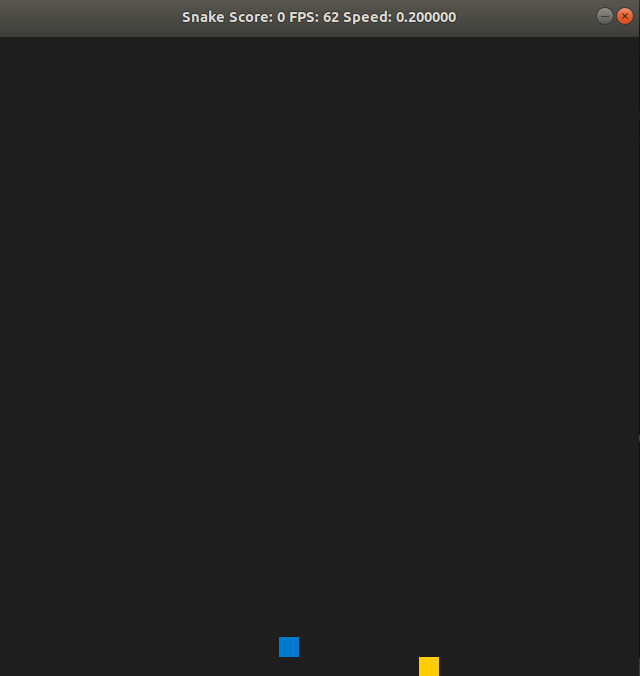

# Udacity-CppND

This repository keeps all the project that I have created by C++, a high-performance programming language used in the world's most exciting engineering jobs -- from self-driving cars and robotics, to web browsers, media platforms, servers, and even video games. All of these projects contrubuted by Udacity and implemented by me.

## Route Planning Project

## System Monitor

## Memory Management Chatbot

## Concurrent Traffic Simulation

## Capstone Snake Game with extension

